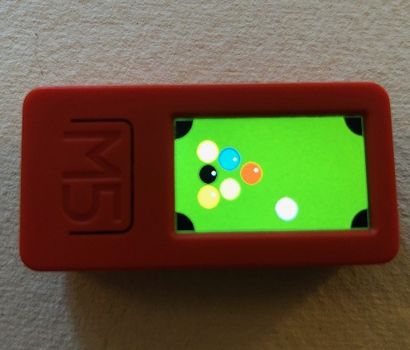

# Created by Peter Trier (Trierlab.com)

As a part of this course https://cs.au.dk/~bouvin/dBIoTP2PC/2017/

# PocketPool

Pocket pool is simple 2d pool game for the M5StickCPlus, using Arduino C++.
The motivation was to investigate how sensor interaction and sprite graphics works.
And most of the games/demos using the BackBurner are pretty basic

# Building

Only tested on M5StickCPlus
Use the Arduino IDE:

1. Use open sketch and select PocketPool.ino
2. Connect M5StickCPlus
3. Upload
4. Play!!

# Screenshot

